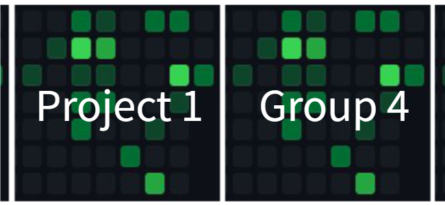

## Project 1 Group4

## 🔍 About

We are a group of 4 full-time working professionals contributing to a project to showcase our 
knowledge and learning capabilities through Monash BootCamp Education. 

## 🖥 Project Brief

Our project aims to conduct a comparative analysis of health and sanitation data in two countries, Afghanistan and Senegal, over a 2-year time point. The primary objective is to assess improvements or deteriorations in the health and sanitation industry within these nations. The project will utilize Health Nutrition and Population Statistics data categorized by Wealth Quintiles to derive meaningful insights.

## 💡 Project Objectives

- Compare and contrast health and sanitation indicators between Afghanistan and Senegal over a 2-year time point.
- Identify significant trends and patterns within the data that highlight improvements or deteriorations in each country's health and sanitation sector.

## 🧰 Languages and Tools

In this project we outline the tools, language and libraries required to complete the project brief.
 

 
 
 
----------------------------------------------------------------------------------------------------------
## 🔄 Project Workflow 

 

## ⏰ Project Time-frame

The project is expected to be completed within 2 weeks from the date of initiation.  
Start of project: `09 October 2023`  
Completion of project: `19 October 2023`

## 👨‍💼💻👩‍💼 Contributors 

| 
Contributors
    | 
Github Profile
                         |
| ----------------| -------------------------------------- |
| 
Choon Sien
      | https://github.com/sienchoon           |    
| 
Ekjyot
 |                                        |
| 
Parminder
| https://github.com/parmbasra           |
| 
Sohaila
| https://github.com/S-haila             |

## Licensing
The World Bank Data Catalog  
Health Nutrition and Population Statistics by Wealth Quintile

https://datacatalog.worldbank.org/search/dataset/0037656/Health-Nutrition-and-Population-Statistics-by-Wealth-Quintile

